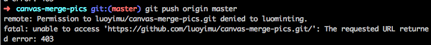

最近申请了个新GitHub账号使用，写一篇文章来记录一下如何解决一台电脑绑定两个GitHub帐号的过程，多个的也同理。

#### 一：生成新账号对应的`ssh-key`
本地仓库与`github`上的远程仓库进行通信的时候，必须得双方建立连接才行，`ssh-key`是两者之间建立连接的一把钥匙

1. 生成`ssh-key`命令：
 ``` bash
  ➜ ssh-keygen -t rsa -f ~/.ssh/id_rsa_2 -C "lminting@hotmail.com"
 ```
 生成key时取个新的名字`id_rsa_2`，不要覆盖旧的。

 可以用命令==`ls ~/.ssh/`==列出已有的key。

2. 执行 `ssh-add` 让ssh识别新的私钥

 为了让SSH识别新的私钥，需将其添加到SSH agent中：

 ``` bash
  ➜  ssh-add ~/.ssh/id_rsa_2
  # 出现这句表示成功 Identity added: id_rsa_2 (id_rsa_2)
 ```
 如果出现`Could not open a connection to your authentication agent`的错误，尝试以下命令后再`ssh-add`
 ``` bash
  ➜  ssh-agent bash
 ```

  `ssh-add -l` 可查询已有的私钥

3. 把`id_rsa_2.pub`加到新账号上的SSH设置中：
 - 通过 `ls ~/.ssh/` 查看已有密钥文件
 - 使用 `cat id_rsa_2.pub` 浏览文件内容
 - 添加到 github 设置中

4. 配置 `~/.ssh/config` 文件
 因为有两对 `ssh-key` 对应不同的账号。所以需要一个config文件来映射对应的账号。
 ``` bash
  ➜  touch config  #没有的话，先创建config文件
 ```
 ``` bash
  ➜  vim config   #编辑config文件
 ```

 ``` bash
  # 在~/.ssh/config文件加上以下内容
  Host luominting.github.com   #github别名
  HostName github.com
  IdentityFile ~/.ssh/id_rsa   #ssh-key名

  Host luoyimu.github.com
  HostName github.com
  IdentityFile ~/.ssh/id_rsa_2
  ```
5. 取消全局 用户名/邮箱设置，并进入项目文件夹单独设置
 ``` bash
  # 取消全局 用户名/邮箱 配置
  git config –global –unset user.name
  git config –global –unset user.email
  # 单独设置每个repo 用户名/邮箱
  git config user.email “xxxx@xx.com”
  git config user.name “xxxx”
```

6. 测试 ssh 连接
 ``` bash
  ➜  ssh -T luoyimu.github.com #上文设置的github别名
  # Hi luoyimu! You've successfully authenticated, but GitHub does not provide shell access.
  # 出现这句话，表示连接成功
```

 完成以上步骤后，来尝试push至新账号，看能否成功啦~

 难过的是,还是失败了。
 

 那就删除远程分支,再重建远程分支，然后就push成功啦~
 
 
 

 尝试了一下旧账号的项目(在项目文件夹需重设置用户名/邮箱)，也完美push。
