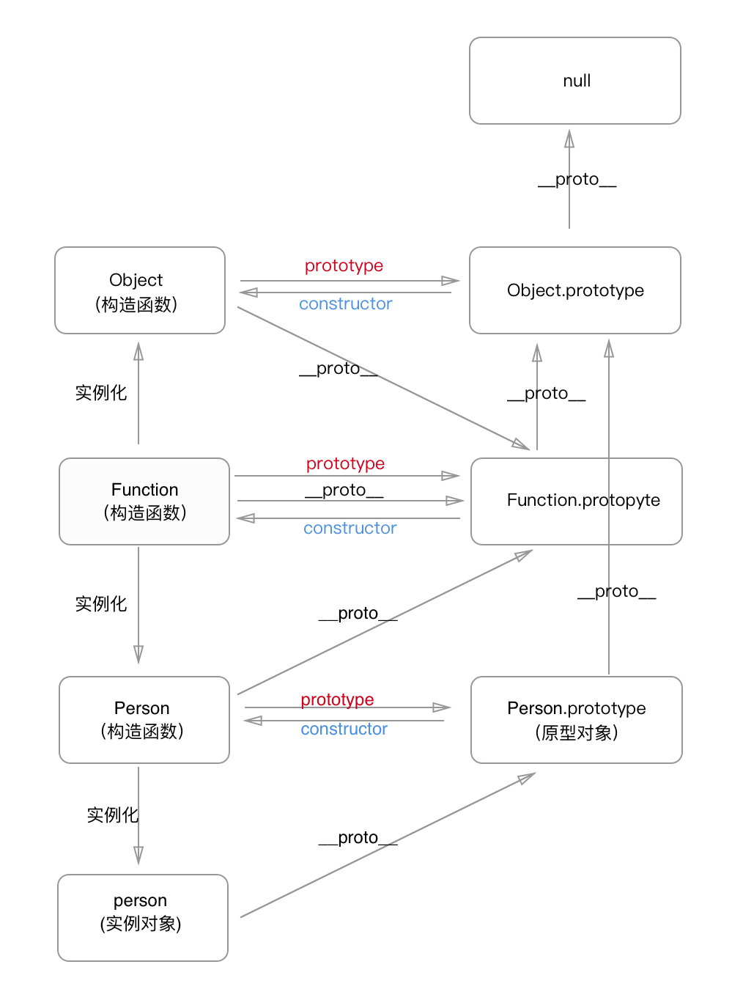

### 一.构造函数
构造函数是用在创建对象时初始化对象，特点为构造函数名一般为大写字母开头，用`new`运算符来实例化对象。
```javascript
	function Person(){
    	this.name = 'xiaomin'
        this.age = 18
    }
    let person = new Person()
```
在这个例子中，`Person` 就是一个构造函数，我们使用 `new` 创建了一个实例对象 `person`。

### 二.原型对象
每个函数对象都有一个 `prototype` 属性
```javascript
	function Person(){
    }
    Person.prototype.name = 'xiaomin'
    Person.prototype.age = 18
    let person = new Person()
```
这个 `prototype` 属性指向函数的==原型对象==,原型对象可以理解为函数在创建的过程中，系统自动创建出来与函数相关联的一个空的对象。

构造函数和原型对象之间的关系:


### 三.`constructor`属性
每个原型对象都有一个 `constructor` 属性，这个属性指向 `prototype` 属性所在的构造函数

构造函数与原型对象、`constructor`属性三者之间的关系:
```javascript
	Person.prototype.constructor === Person //true
```


### 四.`__proto__`
每个JavaScript对象(除了 `null` )都有一个 `__proto__` 的内置属性，指向创建它的构造函数的原型对象。

``__proto__``与原型对象之间的关系:
```javascript
	person.__proto__ === Person.prototype //true
```


### 五.原型链
每个对象都有自己的原型对象，原型对象本身也是对象，也有自己的原型对象，这样就形成了一个链式结构，叫做原型链。

当访问对象的属性，是首先在对象本身去找，如果找不到，会去对象关联的原型对象中找，如果还找不到，就去找原型的原型，一直找到原型链的最顶层为止。

```javascript
	function Person(){
    }
    Person.prototype.name = 'xiaomin'

    let person = new Person()
    person.name = 'xiaolie'
    console.log(person.name) //xiaolie

    delete person.name
    console.log(person.name) //xiaomin
```
这段代码中，访问 `person.name` 时，首先会从对象本身找该属性，所以输出`xiaolie`。

当删除实例对象 `person` 的 `name`属性时，再次访问 `person.name` 时，在对象本身找不到该属性，就会访问实例对象的原型 `person.__proto__`，也就是 `person.prototype` 中查找。所以输出`xiaomin`。

如果`person.prototype`也没有定义呢，就会继续往原型的原型中查找，`person.prototype.__proto__`,也就是 `Object.prototype`.

再往上找，`Object.prototype.__proto__`，这个比较特殊，为`null`，也就是原型链的最顶层了，所以查找属性的时候查到 `Object.prototype` 就可以停止查找了。


### 六.原型链继续补充
#### 1.普通对象和函数对象

JavaScript 对象，分为普通对象和函数对象。区分方法：**通过 `new Function()` 创建的对象都是函数对象，其他的都是普通对象。**

```javascript
    function f1(){}
    let f2 = function(){}
    let f3 = new Function('str','console.log(str)')

    let o1 = {}
    let o2 = new Object()
    let o3 = new f1()

    console.log(typeof Object) //function
    console.log(typeof Function)  //function

    console.log(typeof f1) //function
    console.log(typeof f2) //function
    console.log(typeof f3) //function

    console.log(typeof o1) //object
    console.log(typeof o2) //object
    console.log(typeof o3) //object
```

`f1、f2`归根结底都是通过 `new Function()` 的方式进行创建的。`Object、Function` 是 JS 自带的函数对象，也是通过 `New Function()`创建的。

原型对象是普通对象(`Function.prototype`除外)
```javascript
    function Person(){}
    console.log(Person.prototype)          // Person{}
    console.log(typeof Person.prototype)   //object
    console.log(typeof Object.prototype)   //object
    console.log(typeof Function.prototype) //function 特殊
    console.log(typeof Function.prototype.prototype) //undefined
```
`Function.prototype`是函数对象，但没有`prototype`属性
```javascript
    let A = new Function()
    Function.prototype = A
```
上文提到：**通过 `new Function()` 创建的对象都是函数对象，其他的都是普通对象。**,因为A是函数对象，所以`Function.prototype`是函数对象。


#### 2.`__proto__` 与 `prototype` 的关系
 - **每个函数对象的 `__proto__` 都指向 `Function.prototype` **

	JavaScript语言有九种内建的函数构造器：`Object(), Array(), String(), Number(), Boolean(), Date(), Function(), Error() 以及 RegExp()`
```javascript
	function Person() {}  // 函数声明
    let person = function() {} // 函数表达式
    Person.__proto__ === Function.prototype  // true
    person.__proto__ === Function.prototype     // true

    Object.__proto__ === Function.prototype  // true
    Function.__proto__ === Function.prototype // true
    Number.__proto__ === Function.prototype  // true
    Boolean.__proto__ === Function.prototype // true
    String.__proto__ === Function.prototype  // true
    Array.__proto__ === Function.prototype   // true
    RegExp.__proto__ === Function.prototype  // true
    Error.__proto__ === Function.prototype   // true
    Date.__proto__ === Function.prototype    // true
```

	所有的函数对象都来自于`Function.prototype`，都继承了`Function.prototype`的属性及方法。如`length、call、apply、bind（ES5）`。

	`Function.prototype`是唯一一个`typeof XXX.prototype`为 `function`的`prototype`。其它的构造器的 `prototype` 都是一个对象。
```javascript
    console.log(typeof Function.prototype) // function
    console.log(typeof Object.prototype)   // object
    console.log(typeof Number.prototype)   // object
    console.log(typeof Boolean.prototype)  // object
    console.log(typeof String.prototype)   // object
    console.log(typeof Array.prototype)    // object
    console.log(typeof RegExp.prototype)   // object
    console.log(typeof Error.prototype)    // object
    console.log(typeof Date.prototype)     // object
```
```javascript
    Function.prototype.__proto__ === Object.prototype //true
```
	`Function.prototype`也是函数对象，讲道理`__proto__` 也应指向 `Function.prototype`，但在JavaScript一直强调万物皆对象，函数对象也是对象，给他认个祖宗，指向`Object.prototype`。保证原型链能够正常结束。

    这也说明所有的构造器也都是一个普通JS对象，可以给构造器添加/删除属性等。同时它也继承了	`Object.prototype`上的所有方法：`toString、valueOf、hasOwnProperty`等。

	最后，到原型链顶端了
```javascript
	Object.prototype.__proto__ === null  // true
```
- - -

- **每个对象的 `__proto__` 都指向创建它的构造函数的 `prototype` **
```javascript
    let obj = new Object()
    let arr = new Array()
    let reg = new RegExp()
    let date = new Date()
    console.log(obj.__proto__ === Object.prototype) // true
    console.log(arr.__proto__ === Array.prototype)  // true
    console.log(reg.__proto__ === RegExp.prototype) // true
    console.log(date.__proto__ === Date.prototype)  // true

    function Person() {
        this.name = xiaolie
    }
    let person = new Person()
    console.log(person.__proto__ === Person.prototype) // true
```

