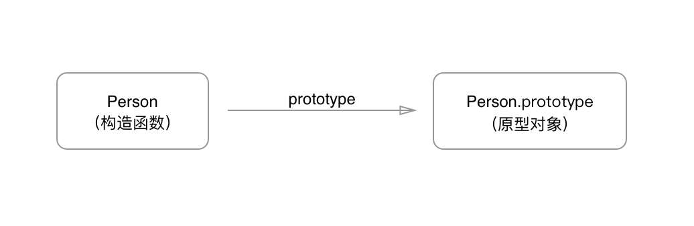
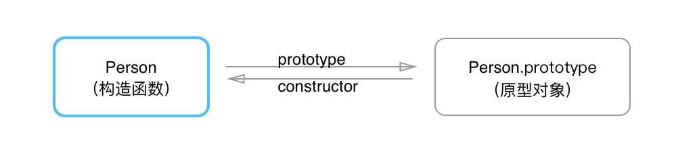
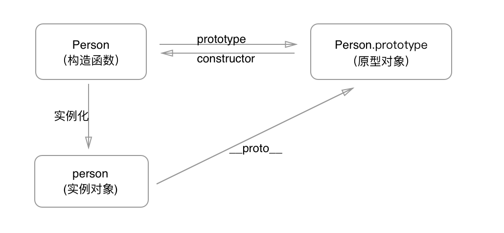
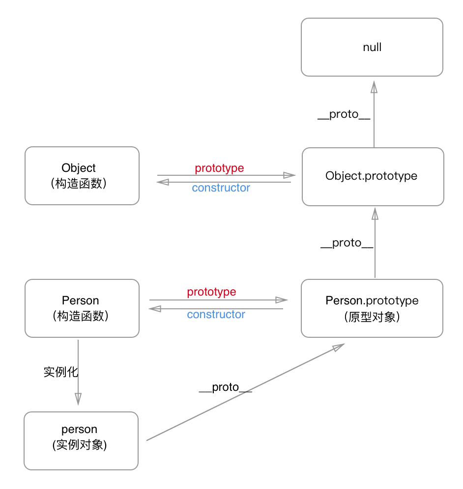

### 一.构造函数
构造函数是用在创建对象时初始化对象，特点为构造函数名一般为大写字母开头，用`new`运算符来实例化对象。
```javascript
	function Person(){
    	this.name = 'xiaomin'
        this.age = 18
    }
    let person = new Person()
```
在这个例子中，`Person` 就是一个构造函数，我们使用 `new` 创建了一个实例对象 `person`。

### 二.原型对象
每个函数对象都有一个 `prototype` 属性
```javascript
	function Person(){
    }
    Person.prototype.name = 'xiaomin'
    Person.prototype.age = 18
    let person = new Person()
```
这个 `prototype` 属性指向函数的==原型对象==,原型对象可以理解为函数在创建的过程中，系统自动创建出来与函数相关联的一个空的对象。

构造函数和原型对象之间的关系:```Person == Person.prototype //true```


### 三.`constructor`属性
每个原型对象都有一个 `constructor` 属性，这个属性指向 `prototype` 属性所在的构造函数

构造函数与原型对象、constructor属性三者之间的关系: ```Person.prototype.constructor == Person //true```


### 四.`__proto__`
每个JavaScript对象(除了 null )都有一个 `__proto__` 的内置属性，指向创建它的构造函数的原型对象。

``__proto__``与原型对象之间的关系: ```person.__proto__ == Person.prototype //true```


### 五.原型链
每个对象都有自己的原型对象，原型对象本身也是对象，也有自己的原型对象，这样就形成了一个链式结构，叫做原型链。

当访问对象的属性，是首先在对象本身去找，如果找不到，会去对象关联的原型对象中找，如果还找不到，就去找原型的原型，一直找到原型链的最顶层为止。

```javascript
	function Person(){
    }
    Person.prototype.name = 'xiaomin'

    let person = new Person()
    person.name = 'xiaolie'
    console.log(person.name) //xiaolie

    delete person.name
    console.log(person.name) //xiaomin
```
这段代码中，访问 `person.name` 时，首先会从对象本身找该属性，所以输出`xiaolie`。

当删除实例对象 `person` 的 `name`属性时，再次访问 `person.name` 时，在对象本身找不到该属性，就会访问实例对象的原型 `person.__proto__`，也就是 `person.prototype` 中查找。所以输出`xiaomin`。

如果`person.prototype`也没有定义呢，就会继续往原型的原型中查找，`person.prototype.__proto__`,也就是 `Object.prototype`.

再往上找，`Object.prototype.__proto__`，这个比较特殊，为`null`，也就是原型链的最顶层了，所以查找属性的时候查到 `Object.prototype` 就可以停止查找了。

